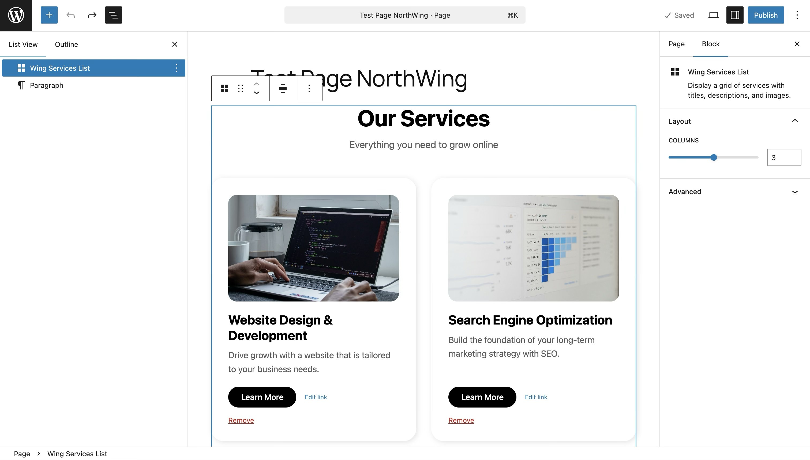
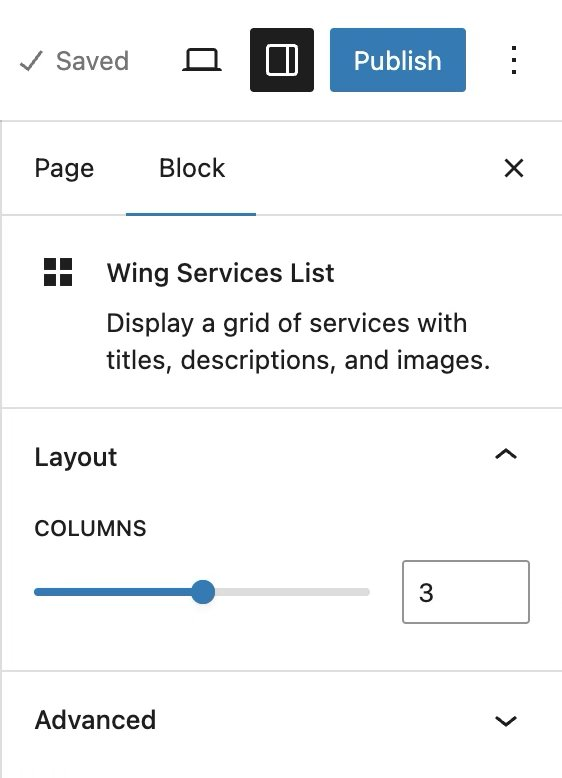

# Wing Services List

A custom Gutenberg block for displaying a responsive grid of services with images, titles, descriptions, and call-to-action links. Built for the NorthWing Digital developer challenge.


## About

Wing Services List is a WordPress plugin that registers a single Gutenberg block, intended as a homepage or services-page component for a digital agency site. Content editors can manage the list of services directly from the block editor, with full inline editing, media library integration, and per-card link controls. The block renders dynamically on the front end via PHP.

The visual identity is matched to NorthWing Digital's brand language: Overpass for headings, Roboto for body copy, generous border radius, soft shadows.

## Features

- Inline-editable section heading and subheading
- Repeatable list of service items (add, remove, edit)
- Per-service image picker with the WordPress media library
- "Replace" affordance on hover for already-selected images
- Per-service call-to-action link with custom label, URL, and "open in new tab" toggle
- Sidebar control to switch between 2, 3, or 4 columns
- Responsive grid (1 column on mobile, 2 on tablet, 2–4 on desktop)
- Wide and full alignment support
- Empty-state placeholder for cards without an image

## Demo

### Editor view



### Front end view


### Sidebar controls



## Tech stack

- PHP 7.4+
- JavaScript (React 18, JSX)
- SCSS
- WordPress 6.8+
- `@wordpress/scripts` (build tooling)
- `@wordpress/env` (local development environment)

## Installation & local development

### Prerequisites

- [Node.js](https://nodejs.org/) 20 or higher
- [Docker Desktop](https://www.docker.com/products/docker-desktop/)
- npm 10+

### Setup

```bash
# Clone the repository
git clone https://github.com/<your-username>/wing-services-list.git
cd wing-services-list

# Install dependencies
npm install

# Build the block
npm run build

# Start the local WordPress environment
npx @wordpress/env start
```

The site will be available at `http://localhost:8888`.
WordPress admin: `http://localhost:8888/wp-admin` (default credentials `admin` / `password`).

### Development workflow

```bash
# Watch for source changes and rebuild automatically
npm start
```

Edit any file inside `src/wing-services-list/` and the build will update automatically. Refresh the WordPress editor or front end to see changes.

To stop the local environment:

```bash
npx @wordpress/env stop
```

### Using the block

1. From the WordPress admin, create or edit a Page.
2. Click the block inserter (**+** icon) and search for "Wing Services List".
3. Edit the heading, subheading, service titles, descriptions, images, and links inline.
4. Use the **Layout** panel in the right sidebar to adjust the column count (2–4).
5. Use the alignment toolbar to set wide or full-width.

## Project structure

```
wing-services-list/
├── build/                          # Compiled output (generated)
├── src/
│   └── wing-services-list/
│       ├── block.json              # Block metadata + attribute schema
│       ├── edit.js                 # Editor React component
│       ├── editor.scss             # Editor-only styles
│       ├── index.js                # Block registration
│       ├── render.php              # Front-end render template
│       ├── save.js                 # Returns null (dynamic rendering)
│       └── style.scss              # Shared frontend + editor styles
├── .wp-env.json                    # Local dev environment config
├── package.json
├── README.md
└── wing-services-list.php          # Plugin entry point
```

## What's outstanding / would add with more time

- Drag-and-drop reordering of service cards
- Per-block color and typography overrides via the InspectorControls
- A "compact" style variant (smaller cards, denser grid)
- Pre-built block patterns showing common configurations
- Unit tests for the PHP render function

## Author

Ignacio Talvi Robledo